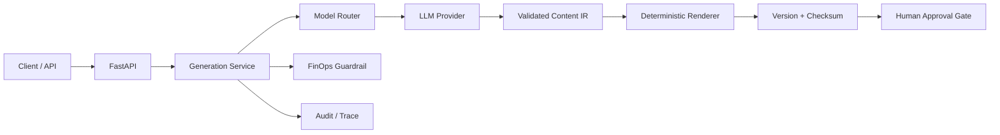

# AI Content Platform Showcase

> **Sanitized engineering portfolio.** This public repository is a genericized representation of software-engineering patterns implemented in a private production codebase. Proprietary business logic, customer data, credentials, production resource names, internal domains, and vendor-specific secrets are intentionally excluded.

A compact reference implementation for an **AI-native content platform** where LLMs produce structured intermediate representations (IR) and deterministic application code renders, versions, audits, and controls the resulting artifacts.

## What this demonstrates

- FastAPI service boundaries and typed contracts with Pydantic
- LLM routing by task complexity instead of hardcoding one model everywhere
- Deterministic rendering from validated JSON/IR
- Immutable version checksums and audit events
- FinOps guardrails with per-run budget enforcement
- Human-in-the-loop approval as a first-class workflow state
- Testable architecture: generation logic is separated from rendering and governance
- Containerized local execution and CI

## Architecture



The key design decision is: **the model proposes content; deterministic code owns structure, validation, cost controls, versioning, and rendering**.

## Repository layout

```text
app/
  main.py
  schemas.py
  services/
    audit.py
    finops.py
    model_router.py
    renderer.py
tests/
  test_renderer.py
docs/
  architecture.md
.github/workflows/
  ci.yml
```

## Run locally

```bash
python -m venv .venv
source .venv/bin/activate   # Windows: .venv\Scripts\activate
pip install -r requirements.txt
uvicorn app.main:app --reload
```

Open `http://localhost:8000/docs`.

## Security and privacy

This showcase contains **no real credentials, customer records, cloud subscription IDs, private endpoints, production prompts, internal model identifiers, or company-specific business rules**.

## Engineering themes

**AI systems engineering · FastAPI · typed contracts · deterministic rendering · governance · observability · FinOps · human approval · CI/CD**
