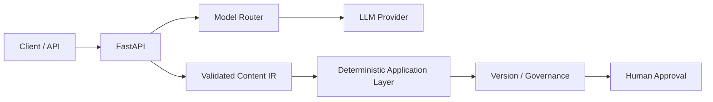

# AI Content Platform Showcase

> **Sanitized engineering portfolio.** This public repository is a genericized representation of engineering patterns implemented in a private production codebase. Proprietary business logic, customer data, credentials, production resource names, internal domains, and vendor-specific secrets are intentionally excluded.

A compact public reference for an **AI-native content platform** built around typed intermediate representations (IR), task-aware model routing, deterministic application boundaries, governance, and testable APIs.

## Implemented in this public sample

- FastAPI service boundary
- Pydantic contracts for structured content IR
- Task-aware model routing abstraction
- Strict input validation
- Automated API tests
- GitHub Actions CI
- Sanitized architecture documentation

## Production architecture represented

The private implementation extends the same design with deterministic artifact rendering, immutable versions/checksums, audit trails, cost controls, human approval gates, observability, knowledge retrieval, and multimodal integrations. Those proprietary implementations are intentionally not copied into this public repository.



The architectural principle is: **models propose structured content; deterministic software owns validation, lifecycle, governance, and delivery**.

## Repository layout

```text
app/
  main.py
  schemas.py
  services/
    model_router.py
tests/
  test_api.py
docs/
  architecture.md
.github/workflows/
  ci.yml
```

## Run locally

```bash
python -m venv .venv
source .venv/bin/activate   # Windows: .venv\Scripts\activate
pip install -r requirements.txt
uvicorn app.main:app --reload
pytest -q
```

Open `http://localhost:8000/docs`.

## Security and privacy

This showcase contains **no real credentials, customer records, cloud subscription IDs, private endpoints, production prompts, internal model identifiers, or company-specific business rules**.

## Engineering themes

**AI systems engineering · FastAPI · typed contracts · model routing · governance · testability · CI/CD**
